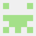

# Final project Self-assessment report

Team: 22120252-22120427-22120450

GitHub repo URL: https://github.com/ducnhat24/AWD-G04

# **TEAM INFORMATION**

| Student ID | Full name | Git account | Contribution | Contribution percentage (100% total) | Expected total points | Final total points |
| :---- | :---- | :---- | :---- | :---- | :---- | :---- |
| 22120252 | Giang Đức Nhật | ducnhat24 | **BE:** - Google OAuth 2.0 integration  - Email Synchronization  - Snooze Mechanism - AI Features - Search Features  -  Filtering & Sorting   - Email Actions   - CI/CD & Dockerize   - Gmail Watch Pub&Sub| 33.3% | 10 |  |
| 22120427 | Nguyễn Mạnh Văn | nmvan | **FE:**  - Email Display   - Kanban Board Interface  - Snooze Mechanism   -  Search & Sort & Filter Email UI   - Email Action   - UI AI summary   - Mockdata Email | 33.3% | 10 |  |
| 22120450 | Bùi Đình Gia Vỹ | VyBui13 | **BE:**  - Authentication & Token Management  **FE:** - Concurrency handling - Login Page  - Signup Page  - Dynamic Kanban Configuration   - Keyboard navigation   - Offline caching   - Multi-tab logout sync | 33.4% | 10 |  |

# **FEATURE LIST**

**Project:** React Email Client with Gmail Integration & AI-Powered Kanban

Students must input minus points to every uncompleted feature in the SE column.

\*SE: Self-evaluation

\*TR: Teacher review

| ID | Features | Grade |  |  | Notes |
| ----- | :---- | ----- | :---- | :---- | :---- |
|  |  | **Point** | **SE\*** | **TR\*** |  |
| **1** | **Overall requirements** |  |  |  |  |
|  | User-centered design | \-5 | 0 |  | Built with user experience in mind. Kanban-style email management, AI summarization, semantic search for efficient email workflow |
|  | Database design | \-1 | 0 |  | Database with tables: users, emails, email_vectors, kanban_columns, snooze_schedules, labels |
|  | Database mock data | \-1 |  |  | **Sample emails, kanban configurations, and test data** |
|  | Website layout | \-2 | 0 |  | 3-column layout: mailbox list, email list, email detail. Kanban board view |
|  | Website architect | \-3 | 0 |  | React SPA with backend API. Clear separation of concerns. OAuth2 flow, token handling |
|  | Website stability and compatibility | \-4 | 0 |  | Responsive design, tested on Chrome, Safari, Firefox, and Edge |
|  | Document | \-2 |  |  | **README with setup guide, API endpoints, Google OAuth setup, token storage explanation, security considerations** |
|  | Demo video | \-5 |  |  | **Video demonstrating: Gmail login, inbox sync, Kanban board, AI summarization, semantic search, drag-drop** |
|  | Publish to public hosts | \-1 | 0 |  | Frontend deployed (Netlify/Vercel), Backend deployed (Render/Railway/Cloud Run) |
|  | Development progress is recorded in Github | \-7 | 0 |  | Git history with meaningful commits, branches for features, pull requests |
| **2** | **Authentication & Token Management** |  |  |  |  |
|  | Google OAuth 2.0 integration | \-0.5 | 0 |  | Login with Google, grant Gmail access permissions |
|  | Authorization Code flow | \-0.5 | 0 |  | Backend exchanges code for tokens, stores refresh token securely |
|  | Token storage & security | \-0.5 | 0 |  | Access token in-memory (frontend), refresh token server-side only |
|  | Automatic token refresh | \-0.5 | 0 |  | Backend refreshes expired access tokens automatically |
|  | Concurrency handling | \-0.25 | 0 |  | Single refresh request when multiple 401s occur |
|  | Forced logout on invalid refresh | \-0.25 | 0 |  | Clear tokens and logout if refresh token fails |
|  | Logout & token cleanup | \-0.25 | 0 |  | Clear all tokens server-side and client-side on logout |
| **3** | **Email Synchronization & Display** |  |  |  |  |
|  | Fetch emails from Gmail | \-0.5 | 0 |  | Use Gmail API to fetch inbox emails |
|  | Email list with pagination | \-0.25 | 0 |  | Paginated/virtualized email list |
|  | Email detail view | \-0.25 | 0 |  | Full email content with HTML/plain text support |
|  | Mailbox/Labels list | \-0.25 | 0 |  | Display Gmail labels/folders in sidebar |
|  | Open in Gmail link | \-0.25 | 0 |  | Button/icon to open email in Gmail |
| **4** | **Kanban Board Interface** |  |  |  |  |
|  | Kanban board layout | \-0.5 | 0 |  | Board with columns: Inbox, To Do, Done, etc. |
|  | Email cards display | \-0.25 | 0 |  | Cards showing sender, subject, snippet |
|  | Drag-and-drop between columns | \-0.5 | 0 |  | Drag cards to change email status |
|  | Status persistence | \-0.25 | 0 |  | Status changes saved and persisted |
|  | Dynamic Kanban Configuration |  |  |  |  |
|  | › Settings interface | \-0.25 | 0 |  | Modal/page to create, rename, delete columns |
|  | › Configuration persistence | \-0.25 | 0 |  | Custom columns saved and restored after reload |
|  | › Gmail label mapping | \-0.5 | 0 |  | Columns map to Gmail labels, moving cards syncs labels |
| **5** | **Snooze Mechanism** |  |  |  |  |
|  | Select snooze time | \-0.25 | 0 |  | Choose snooze duration (Tomorrow, Next week, custom) |
|  | Hide snoozed emails | \-0.25 | 0 |  | Email disappears from Kanban after snooze |
|  | Auto-return on schedule | \-0.5 | 0 |  | Email automatically returns to board at scheduled time |
| **6** | **AI Features** |  |  |  |  |
|  | AI Summarization |  |  |  |  |
|  | › Backend summarization API | \-0.5 | 0 |  | LLM integration (Gemini API) to summarize email content |
|  | › Summary UI on cards | \-0.25 | 0 |  | Display 2-3 line summary on email cards |
|  | Text Embedding |  |  |  |  |
|  | › Embedding generation | \-0.5 |0  |  | Generate vector embeddings for emails using embedding model |
|  | › Vector database storage | \-0.5 | 0 |  | Store embeddings in MongoDB Atlas Vector Search with vector index for similarity search |
| **7** | **Search Features** |  |  |  |  |
|  | Fuzzy Search (Backend) **chưa integrate đúng cách**|  |  |  |  |
|  | › Typo tolerance | \-0.5 | 0 |  | "marketng" finds "marketing" |
|  | › Partial matches | \-0.5 | 0 |  | "Nguy" finds "Nguyen Van A" |
|  | › Relevance ranking | \-0.25 | 0 |  | Best matches ranked first |
|  | Fuzzy Search UI (Frontend) |  |  |  |  |
|  | › Search bar integration | \-0.25 | 0 |  | Search bar in header/main UI |
|  | › Search results as cards | \-0.25 | 0 |  | Results displayed as email cards with sender, subject, snippet |
|  | › Loading/empty/error states | \-0.25 | 0 |  | Handle UX states properly |
|  | › Navigation back to main view | \-0.25 | 0 |  | Clear way to return to Kanban view |
|  | Semantic Search |  |  |  |  |
|  | › Conceptual relevance search | \-0.5 | 0 |  | Query "money" finds "invoice", "price", "salary" |
|  | › Semantic search API endpoint | \-0.25 | 0 |  | POST /api/search/semantic endpoint |
|  | Search Auto-Suggestion |  |  |  |  |
|  | › Type-ahead dropdown | \-0.25 | 0 |  | Dropdown appears while typing with 3-5 suggestions  |
|  | › Suggestions from contacts/keywords | \-0.25 | 0 |  | Suggestions populated from sender names, subject keywords |
|  | › Trigger search on selection | \-0.25 | 0 |  | Clicking suggestion triggers semantic search |
| **8** | **Filtering & Sorting** |  |  |  |  |
|  | Sort by date (newest/oldest) | \-0.25 | 0 |  | At least two sorting options |
|  | Filter by unread | \-0.25 | 0 |  | Show only unread emails |
|  | Filter by attachments | \-0.25 | 0 |  | Show only emails with attachments |
|  | Real-time filter updates | \-0.25 | 0 |  | Changes apply immediately without page reload |
| **9** | **Email Actions** |  |  |  |  |
|  | Mark as read/unread | \-0.25 | 0 |  | Toggle read status via Gmail API |
|  | Compose modal | \-0.25 | 0 |  | Modal to compose new email |
|  | Reply/Forward flow | \-0.25 | 0 |  | Reply to and forward emails |
|  | Send via Gmail API | \-0.25 | 0 |  | Send emails through Gmail API |
|  | View attachments | \-0.25 | 0 |  | Display attachments in email detail |
|  | Download attachments | \-0.25 | 0 |  | Download attachment files |
|  | Delete emails | \-0.25 | 0 |  | Move to trash via Gmail API |
| **10** | **Advanced features** |  |  |  |  |
|  | Gmail Push Notifications | 0.25 | 0.25 |  | Real-time inbox updates via Gmail watch + Pub/Sub |
|  | Multi-tab logout sync | 0.25 | 0.25 |  | BroadcastChannel for logout sync across tabs |
|  | Offline caching | 0.25 | 0.25 |  | IndexedDB + stale-while-revalidate for emails |
|  | Keyboard navigation | 0.25 | 0.25 |  | Navigate emails with keyboard shortcuts |
|  | Dockerize your project | 0.25 | 0.25 |  | Docker containers for backend, frontend |
|  | CI/CD | 0.25 | 0.25 |  | Automated testing and deployment pipeline |

# **GIT HISTORY**

## **Contributors**

| Avatar | Username | Commits | Additions | Deletions |
| :---- | :---- | :---- | :---- | :---- |
|  | ducnhat24 | 39 | 27267 | 2636 |
|  | nmvan | 43 | 4721 | 2200 |
|  | VyBui13 | 15 | 8015 | 4887 |

## **Commits**

*List significant commits here with format:*

| Date | Author | Commit Message | Files Changed |
| :---- | :---- | :---- | :---- |
| YYYY-MM-DD | \<author\> | \<commit message\> | \<number\> |

---

# **PROJECT SUMMARY**

## System Overview
**React Email Client with Gmail Integration** is a web-based email client that transforms Gmail into a Kanban-style productivity tool:
- Gmail OAuth2 authentication with secure token handling
- Kanban board interface for email workflow management (Inbox, To Do, Done)
- AI-powered email summarization using LLM (OpenAI/Gemini)
- Snooze mechanism to temporarily hide and auto-return emails
- Fuzzy search with typo tolerance and partial matching
- Semantic search using vector embeddings for conceptual relevance
- Dynamic Kanban configuration with Gmail label mapping
- Full email actions: compose, reply, forward, delete, attachments

## Technology Stack
- **Architecture:** React SPA + Backend API (Node.js)
- **Frontend:** React, react-window (virtualization), drag-and-drop library
- **Backend:** Node.js with Express
- **Database:** MongoDB with MongoDB Vector Search for embeddings
- **Authentication:** Google OAuth2 (Authorization Code flow)
- **AI/ML:** OpenAI API or Gemini API for summarization and embeddings
- **Email:** Gmail REST API
- **Vector Search:** pgvector or similar vector database
- **Deployment:** Frontend (Vercel), Backend(Vercel)

## API Endpoints
| Endpoint | Description |
| :---- | :---- |
| **Auth** | |
| POST /auth/login | Đăng nhập hệ thống (trả về Access Token & User Info). |
| **Search Features** | |
| GET /mail/search | Fuzzy Search: Tìm kiếm email theo từ khóa (Subject, Sender) dùng Fuse.js. |
| POST /mail/search/semantic | Semantic Search: Tìm kiếm email theo ngữ nghĩa dùng Vector Search (Gemini embedding). |
| GET /mail/suggestions | Auto-suggestion: Gợi ý từ khóa/người gửi khi user đang nhập liệu. |
| **Mail Operations** | |
| GET /mail/mailboxes | Lấy danh sách các hộp thư (Inbox, Sent, Drafts, Trash...). |
| GET /mail/mailboxes/:labelId/emails | Lấy danh sách email trong một hộp thư cụ thể (có phân trang). |
| GET /mail/emails/:id | Lấy chi tiết nội dung của một email. |
| GET /mail/emails/:id/summary | AI Summary: Lấy tóm tắt nội dung email do AI tạo ra. |
| POST /mail/send | Gửi email mới. |
| POST /mail/emails/:id/reply | Trả lời (Reply) một email. |
| POST /mail/emails/:id/forward | Chuyển tiếp (Forward) một email. |
| POST /mail/emails/:id/modify | Thay đổi trạng thái email (Đánh dấu đã đọc, Xóa, Gán nhãn...). |
| GET /mail/attachments/:msgId/:attId | Tải xuống file đính kèm của email. |
| POST /mail/sync | Đồng bộ mail |
| **Kanban Configuration** | |
| GET /kanban/config | Lấy cấu hình bảng Kanban cá nhân của user (danh sách cột, màu sắc, label mapping). |
| POST /kanban/config | Khởi tạo cấu hình Kanban mới (thường gọi khi user lần đầu vào Dashboard). |
| PUT /kanban/config | Cập nhật toàn bộ cấu hình Kanban (ví dụ: thay đổi thứ tự các cột, đổi tên nhiều cột cùng lúc). |
| DELETE /kanban/config | Xóa cấu hình Kanban hiện tại (Reset về mặc định). |
| PATCH /kanban/config/column/:id | Cập nhật thông tin chi tiết của một cột cụ thể (đổi tên cột, đổi màu, đổi Gmail Label liên kết). |
| DELETE /kanban/config/column/:id | Xóa một cột cụ thể khỏi bảng Kanban. |
| **Gmail Watch Pub&Sub** | |
| POST /mail/watch | Endpoint để Gmail Watch |
| POST /mail/notification | Endpoint để nhận thông báo từ Gmail Pub&Sub |

## Key User Flows
1. **Authentication:** Google Sign-In → Backend token exchange → Session created → Redirect to Kanban
2. **Email Sync:** Login → Fetch Gmail inbox → Display as Kanban cards → Real-time updates
3. **Kanban Workflow:** View cards → Drag to columns → Status synced → Gmail labels updated
4. **AI Summary:** Email synced → LLM summarizes → Summary displayed on card
5. **Semantic Search:** User types query → Embedding generated → Vector search → Related emails returned
6. **Snooze:** Select email → Choose snooze time → Email hidden → Auto-returns at scheduled time

## Development Timeline
| Week | Focus | Key Deliverables |
| :---- | :---- | :---- |
| Week 1 | Basic Application | Gmail OAuth, email sync, Kanban interface with cards |
| Week 2 | Core Workflow & AI | Drag-and-drop, snooze mechanism, AI summarization |
| Week 3 | Fuzzy Search & Filtering | Fuzzy search (BE+FE), sorting, filtering on Kanban |
| Week 4 | Semantic Search & Config | Vector embeddings, semantic search, dynamic Kanban config |
| Week 5 | Deployment & Deliverables | Testing, deployment, demo video |

## Security Considerations
- **Access Token:** Stored in-memory on frontend only
- **Refresh Token:** Stored server-side in secure datastore (never exposed to frontend)
- **OAuth Flow:** Authorization Code flow (not implicit) for security
- **Token Refresh:** Handled server-side with concurrency protection
- **Logout:** Clears all tokens and optionally revokes OAuth refresh token

---

*Note: Fill in the student information, contribution details, self-evaluation scores, and git history before submission.*
